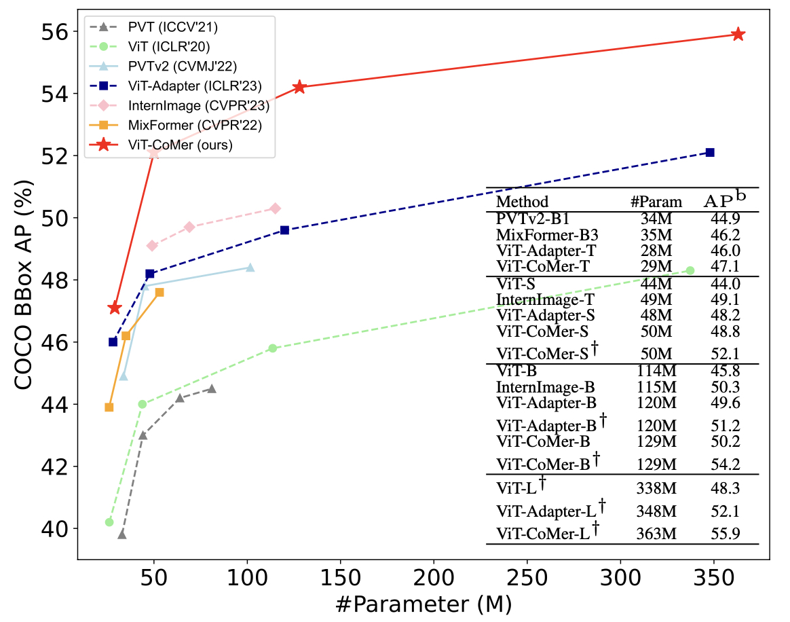
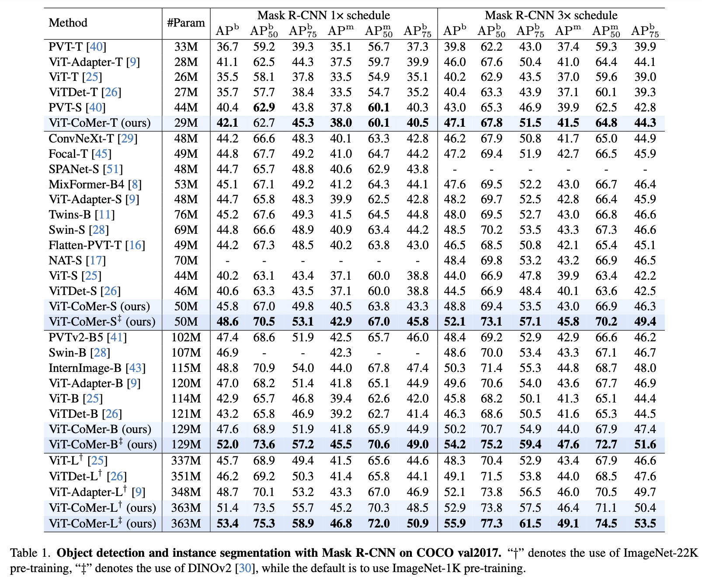
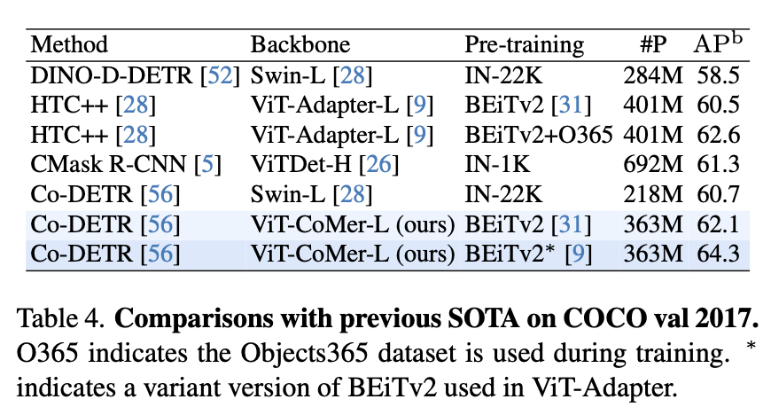
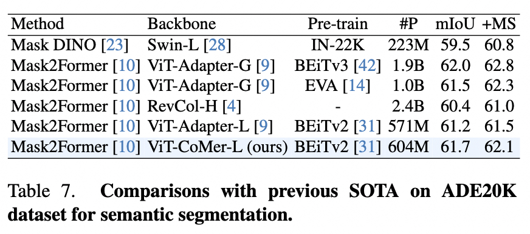

## ViT-CoMer: Vision Transformer with Convolutional Multi-scale Feature Interaction for Dense Predictions

:fire::fire:**[CVPR 2024]** The official implementation of the paper "[ViT-CoMer: Vision Transformer with Convolutional Multi-scale Feature Interaction for Dense Predictions](todo)"

:fire::fire:**\[Guidelines\]**|[Paper](https://arxiv.org/abs/2403.07392) | [ViT-CoMer知乎解读](https://zhuanlan.zhihu.com) | [检测排名图paperwithcode]() |[分割排名图paperwithcode]()|

 <div align=center>  </div>

**The overall architecture of ViT-CoMer.** ViT-CoMer is a two-branch architecture consisting of three components: (a) a plain ViT with L layers, which is evenly divided into N stages for feature interaction. (b) a CNN branch that employs the proposed Multi-Receptive Field Feature Pyramid (MRFP) module to provide multi-scale spatial features, and (c) a simple and efficient CNN- Transformer Bidirectional Fusion Interaction (CTI) module to integrate the features of the two branches at different stages, enhancing semantic information.


## Highlights


 - We propose a novel dense prediction backbone by combining the plain ViT with CNN features. It effectively `leverages various open-source pre-trained ViT weights`  and incorporates spatial pyramid convolutional features that address the lack of interaction among local ViT features and the challenge of single-scale representation.
 - ViT-CoMer-L achieves **`64.3% AP`** on COCO val2017 without extra training data, and **`62.1% mIoU`** on ADE20K val.


## Introduction
We present a plain, pre-training-free, and feature-enhanced ViT backbone with Convolutional Multi-scale feature interaction, named ViT-CoMer, which facilitates bidirectional interaction between CNN and transformer. Compared to the state-of-the-art, ViT-CoMer has the following advantages: (1) We inject spatial pyramid multi-receptive field convolutional features into the ViT architecture, which effectively alleviates the problems of limited local information interaction and single-feature representation in ViT. (2) We propose a simple and efficient CNN-Transformer bidirectional fusion interaction module that performs multi-scale fusion across hierarchical features, which is beneficial for handling dense prediction tasks.
<div align=center>   </div>

## Main Results

**Comparisons with different backbones and frameworks.**  It can be seen that under similar model sizes, ViT-CoMer outper- forms other backbones in the two typical dense prediction tasks of COCO object detection and instance segmentation.
<div align=center>   </div>

**Comparisons with state-of-the-arts.** We conduct experiments based on Co-DETR, using ViT-CoMer as the backbone, and initializing the model with multi-modal pre-training BEiTv2. As shown in Table 4, Our approach outperforms the existing SOTA algorithms without extra training data on COCO val2017, which strongly demonstrates the effectiveness of ViT-CoMer.

**Segmentation.**  We conduct experiments based on Mask2Former using ViT-CoMer as the backbone, and initializing the model with multi-modal pre-training BEiTv2. As shown in Table 7, our method achieves com- parable performance to SOTA methods on ADE20K with fewer parameters. 

<div align=center>

</div>

## News

- [x] create repo
- [ ] release detection/segementation code
- [ ] release beit/dino weights

 
## Quick Start
**Enveriment**
```
pip install -r req.txt
```
**Training**
```
bash run.sh
```

## Citation

## Acknowledgements

